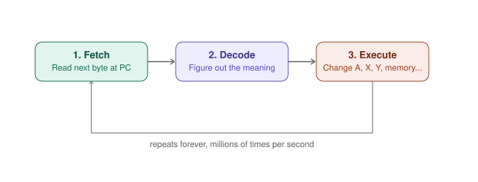
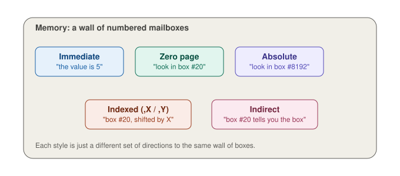
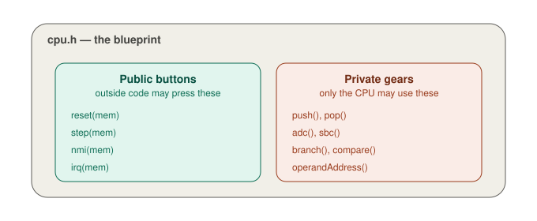
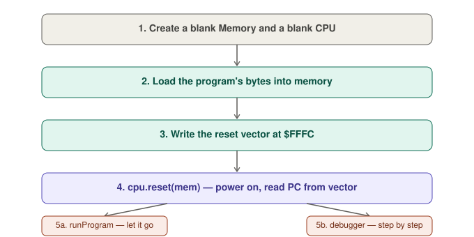
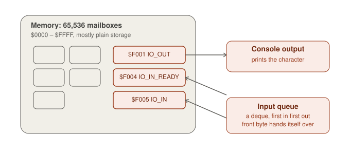

# How the CPU Works 🧠 (Explain Like I'm 5)

This is a friendly guide to `cpu.cpp`, which is the "brain" of a 6502 emulator
(the 6502 is a real, very old computer chip — it's what powered the original
Nintendo, the Commodore 64, and the Apple II).

If `cpu.cpp` feels overwhelming, start here. No code experience needed.

---

## 1. What even is a CPU?

Imagine a tiny, very literal robot. It can't think for itself — it can only
do exactly what a recipe card tells it, one card at a time.

- The "recipe" is the **program** (a list of instructions)
- The robot is the **CPU**
- The **memory** is a giant wall of numbered mailboxes (`0000` to `FFFF`)
  where the recipe cards and ingredients live

The CPU's whole life is just: *look at a card, do what it says, look at the
next card, repeat forever.*

## 2. The heartbeat: Fetch → Decode → Execute

Every single thing the CPU does follows the same 3-step dance, over and over,
millions of times per second:

1. **Fetch** — grab the next instruction byte from memory (look at `PC`, the
   "which mailbox am I reading" pointer)
2. **Decode** — figure out what that byte *means* ("oh, this is a LOAD
   instruction")
3. **Execute** — actually do it (change a register, change memory, etc.)

In the code, this is `CPU::step()`:
```cpp
uint8_t opcode = fetch(mem);   // 1. Fetch
execute(opcode, mem);          // 2. Decode + 3. Execute
```

That's it. That's the whole engine. Everything else in the file is detail
about *what* to do for each of the 256 possible instruction bytes.



## 3. Registers = the robot's pockets

The CPU doesn't have a full desk to work on — just a few tiny pockets it
always carries:

| Register | What's in the pocket |
|---|---|
| `A` (Accumulator) | The main "working" number — most math happens here |
| `X`, `Y` | Helper numbers, often used for counting/looping |
| `PC` | A sticky note that says "read this mailbox next" |
| `SP` | A bookmark for the **stack** (see below) |
| `P` | A row of tiny flags/switches (see below) |

## 4. Flags = sticky notes the CPU leaves for itself

After doing math, the CPU jots down quick notes:

- **Zero (Z)** — "the answer was exactly 0"
- **Negative (N)** — "the answer looked like a negative number"
- **Carry (C)** — "the answer was too big to fit, it overflowed"
- **Overflow (V)** — "the *signed* math got weird"

Later instructions (like branches) *read* these sticky notes to decide what
to do next — e.g. "if the Zero note is stuck up, jump somewhere else."

## 5. The Stack = a stack of plates

`push()` and `pop()` work like a stack of dinner plates:

- **Push** = put a plate on top
- **Pop** = take the top plate off

You can only ever touch the *top* plate. This is how the CPU remembers
"where do I need to come back to?" when it jumps off to run a subroutine
(`JSR`) — it stacks a plate with the return address, and `RTS` pops it back
off when the subroutine is done.

## 6. Addressing modes = different ways to say "where's the ingredient?"

An instruction like ADD needs to know *what number to add*. There are many
ways to describe where that number lives:

- **Immediate**: "add the number 5" (the value is right there in the recipe)
- **Zero Page**: "add whatever is in mailbox #20" (a short, fast address)
- **Absolute**: "add whatever is in mailbox #8192" (a full address)
- **Indexed** (`,X` / `,Y`): "add whatever is at mailbox #20, but shift over
  by however much is in my X pocket" — great for looping through a list
- **Indirect**: "go to mailbox #20, and *that* tells you which mailbox to
  actually use" — like a mailbox containing directions to another mailbox

`operandAddress()` in the code is the function that works out "which mailbox
are we actually talking about" for each of these styles.



## 7. Interrupts = someone rings the doorbell

Sometimes something outside interrupts the CPU's recipe-reading — like a
controller button being pressed. The CPU:

1. Remembers exactly where it was (pushes `PC` and flags onto the stack)
2. Runs a special "answer the door" mini-recipe
3. Comes back and continues exactly where it left off

`NMI` = a doorbell that **always** must be answered.
`IRQ` = a doorbell that can be **ignored** if the CPU put a "do not disturb"
flag up (`IRQ_DISABLE`).

## 8. "Illegal" opcodes = secret, undocumented moves

The original chip designers only *meant* to support some instruction bytes.
But due to how the chip's insides worked, the leftover unused byte values
accidentally *also* did something. Some old games ended up depending on
these accidental behaviors! `executeIllegalOpcode()` recreates them for
compatibility — they're off by default (`enableIllegalOpcodes`).

## 9. The disassembler = a translator

`disassemble()` doesn't run any code — it just *reads* a mailbox and prints
a human-friendly sentence like `LDA $2000,X` instead of raw numbers like
`BD 00 20`. It's purely for humans (or debuggers) to understand what a
recipe card says, without actually following it.

## 10. `cpu.h` — the blueprint (vs. `cpu.cpp`, the actual robot)

If `cpu.cpp` is the robot actually doing the work, `cpu.h` is more like the
robot's spec sheet — a list of "here's what this robot *has* and *can do*",
without the messy details of *how*.

Two kinds of things live in `cpu.h`:

**1. What the CPU carries around (its "state")**
```cpp
uint8_t A = 0;   // one pocket
uint8_t X = 0;   // another pocket
uint16_t PC = 0; // the sticky note pointing at the next instruction
```
This is the exact same pockets/sticky-notes/bookmark idea from the guide
above — `cpu.h` is just the place that officially *declares* they exist.

**2. What the CPU can be asked to do (its "moves")**
```cpp
void step(Memory& mem);   // "do one fetch-decode-execute round"
void reset(Memory& mem);  // "power on"
void nmi(Memory& mem);    // "answer an urgent doorbell"
```
These are just the function *names and shapes* — no actual behavior. The
real behavior (what `step()` actually *does*) lives over in `cpu.cpp`. Think
of `cpu.h` as a table of contents, and `cpu.cpp` as the chapters.

### `public` vs `private` = "buttons on the outside" vs "gears on the inside"

Near the bottom, everything after the word `private:` is stuff **only the
CPU itself is allowed to touch** — like `push()`, `pop()`, `adc()`,
`branch()`. Other code (like the emulator's main loop) isn't allowed to call
these directly. It can only press the public "buttons": `reset()`, `step()`,
`nmi()`, `irq()`.

This matters because it keeps outside code from accidentally reaching in and
scrambling the CPU's stack or math mid-instruction — the same way a
microwave only gives you a few buttons on the outside, and hides the
spinning motor and magnetron parts inside where you can't poke them.



### Why flags get secret names (the `enum StatusFlag`)

```cpp
enum StatusFlag : uint8_t {
    CARRY = 0x01,
    ZERO  = 0x02,
    ...
};
```
Remember the "sticky notes" from section 4? On real hardware they're not
separate notes at all — they're all squeezed into a *single byte* (`P`),
one bit each, like eight tiny light switches in a row. `0x01`, `0x02`, `0x04`
etc. are just "which switch" (bit 0, bit 1, bit 2...). Giving each switch a
name like `CARRY` or `ZERO` means the rest of the code never has to
remember "wait, was carry bit 0 or bit 3?" — it just says `CARRY`.

### Why `AddressMode` lives in the header

The list of addressing "styles" from section 6 (Immediate, ZeroPage,
Absolute, ...) is declared once in `cpu.h` as an `enum class`, so both
`cpu.cpp` (which *uses* the addresses) and the disassembler (which *prints*
them) agree on the same set of names. One shared vocabulary, no mismatches.

## 11. `main.cpp` — the control panel

`cpu.cpp` and `cpu.h` are the robot itself. `main.cpp` is everything
*outside* the robot: the on/off switch, the slot where you insert the
recipe cards, and the little window where you can watch it work.

The CPU never reads a file, never prints to your screen, and never looks at
command-line flags — it only knows about registers and memory. `main.cpp`
is the "outside world" that sets all that up before letting the CPU do its
thing.

### Step by step, what `main()` actually does

1. **Build a blank CPU and a blank Memory** — an empty robot and an empty
   wall of mailboxes.
2. **Load a program into memory** (`loadProgram` / `loadBinaryFile`) — like
   sliding a stack of recipe cards into specific mailboxes. The CPU doesn't
   know or care *how* they got there; it just starts reading.
3. **Write the reset vector** (`writeVector(mem, 0xFFFC, pcAddress)`) — this
   is a sticky note left in mailbox $FFFC/$FFFD that says "hey CPU, when you
   wake up, start reading recipe cards from *here*." Recall from section 1
   that `reset()` reads exactly this note to set `PC`.
4. **Call `cpu.reset(mem)`** — power the robot on. It reads that sticky note
   and gets ready to go.
5. **Run it** — either all at once (`runProgram`, just calls `cpu.step()` in
   a loop until it halts) or one instruction at a time with a person
   watching (`debugger`).



### Two ways to watch the robot work

- **`runProgram`** is "let it go" — it calls `cpu.step()` over and over,
  optionally printing each instruction and the registers as it happens
  (`trace`), until the CPU halts or it hits a safety limit (`maxSteps`, so a
  program stuck in an infinite loop doesn't run forever).
- **`debugger`** is "pause after every step and ask me what to do" — a tiny
  command prompt (`dbg>`) where you can type things like `step`, `regs`, or
  `mem $10 16` to peek at what the CPU is doing before letting it continue.
  This is the same idea as a chef watching each step of a recipe in slow
  motion instead of letting the kitchen run unsupervised.

### Small helper functions, in plain terms

- **`parseAddress`** — lets you type an address as `1536`, `$0600`, or
  `0x0600` and get the same number back. Just a friendlier way to type
  numbers.
- **`loadBinaryFile`** — opens a file and reads its raw bytes, no questions
  asked. The file is assumed to already be actual 6502 machine code.
- **`dumpMemory`** — prints a chunk of mailboxes as hex numbers, 16 per row,
  so a person can eyeball what's stored there.
- **`disassembleRange`** — repeatedly calls `cpu.disassemble()` (from
  section 9) and walks forward by however many bytes each instruction used,
  printing a short program listing.

### If no file is given

If you don't hand the emulator a `.bin` file, it loads a tiny 13-byte
built-in program instead — just enough to load some numbers around, store
them, and stop — so you can build the project and immediately see it do
*something* without needing a real 6502 program on hand.

## 12. `memory.h` / `memory.cpp` — the wall of mailboxes, for real

Every earlier section talked about "the wall of 65,536 numbered mailboxes"
as a metaphor. `memory.h` is where that metaphor becomes actual code:

```cpp
std::array<uint8_t, MEM_SIZE> data{};   // MEM_SIZE = 64 * 1024
```

That's it — one giant array of 65,536 bytes. Every `mem.read(address)` and
`mem.write(address, value)` the CPU calls is just "look at slot `address` in
this array." The CPU never sees the array directly; it only ever asks
Memory to `read` or `write` for it, the same way you don't reach into a
vending machine — you press a button and it hands something back.

### Most mailboxes are boring. A few are magic.

Normally, writing a number into a mailbox just... stores it there. Nothing
happens. But this emulator carves out three special mailbox addresses that
*do something* the moment you touch them:

| Address | What happens |
|---|---|
| `$F001` (`IO_OUT`) | Writing a byte here **prints a character** to the screen |
| `$F004` (`IO_IN_READY`) | Reading here tells you **"is a key waiting?"** (1 or 0) |
| `$F005` (`IO_IN`) | Reading here **hands you the next typed character** |

This trick is called **memory-mapped I/O**. As far as the CPU is concerned,
it's just doing an ordinary `STA $F001` (store A to memory) — the exact
same instruction it would use to store a number anywhere else. It has no
idea it just printed a letter to your screen. All the "magic" is hidden
inside `Memory::read()` and `Memory::write()`, which check "is this address
one of the special ones?" before falling back to "just read/write the
array like normal."

Think of it like a normal wall of PO boxes where three of the boxes happen
to be connected to a fax machine instead of just holding paper. You put a
letter in slot #1, and it doesn't sit there — it gets faxed out immediately.



### The input queue = a line of people waiting to be let in

```cpp
mutable std::deque<uint8_t> inputBuffer{};
```

When you run the emulator with `--input HELLO`, those characters don't
appear instantly — they get lined up in `inputBuffer`, first-in-first-out,
like a line at a ticket counter. Each time the 6502 program reads `$F005`,
the *front* person in line steps up and hands over their character
(`pop_front`), and everyone behind them shuffles forward one spot.

`$F004` lets the program politely check "is anyone in line?" before trying
to read, so it doesn't have to guess.

### Why `mutable`?

`read()` is marked `const` — a promise that reading memory won't change
anything. But consuming a queued input byte *does* change something (it
removes that byte from the line!). `mutable` is C++'s way of saying "this
one specific piece, `inputBuffer`, is allowed to change even inside a
function that promises not to change anything else." It's a small,
deliberate exception, not a loophole for the whole struct.

### `reset()` here is different from `CPU::reset()`

`Memory::reset()` wipes every mailbox back to zero — like erasing a
whiteboard completely. `CPU::reset()` (section 1) does **not** touch
memory at all; it only resets the CPU's own pockets and sticky notes. On
real hardware, powering a computer back on doesn't erase your RAM either —
that's exactly why this emulator keeps the two `reset()`s separate.

---

## TL;DR for a 5-year-old

> The CPU is a robot that reads tiny recipe cards from a giant wall of
> numbered mailboxes, one at a time, forever. It keeps a few numbers in its
> pockets, leaves itself sticky notes about what just happened, and can
> stack up "come back here" bookmarks when it goes off to do a side task.

---

*This guide covers `cpu.cpp`, `cpu.h`, `main.cpp`, and `memory.h`/
`memory.cpp`. Share more files and we'll keep this growing into one
friendly story of the whole repo.*
